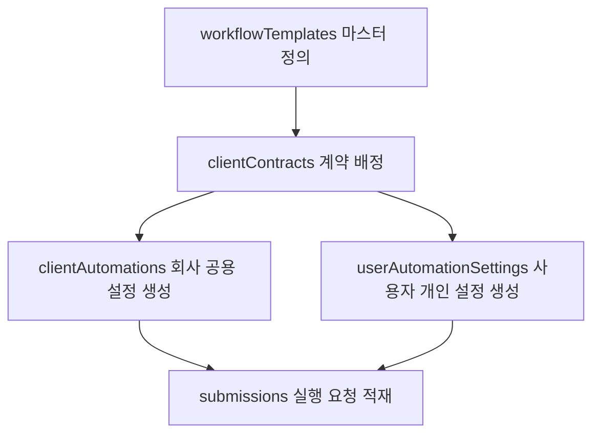

# N8Lient DB 연동 규약서

이 문서는 n8n 워크플로우를 엔팔라이언트(N8Lient) 데이터베이스 구조에 맞게 연동하거나 조회할 때 지켜야 할 Firestore DB 기준서입니다.

---

## 1. Firestore 컬렉션 구조 및 역할

N8Lient MVP의 핵심 데이터는 Firestore에 보관되며, 아래 9개 컬렉션을 중심으로 유기적으로 연동됩니다.

| 컬렉션명 | 설명 및 역할 | 문서 ID 규칙 |
| :--- | :--- | :--- |
| **`clients`** | 고객사(회사) 기본 정보 관리 | 임의 생성 ID (예: `client_rentaltoktok_001`) |
| **`users`** | 사용자 프로필 및 권한 정보 | Firebase Auth의 **`uid`** |
| **`companyCodeLookups`** | 회사코드 입력 시 clientId 조회를 위한 보안 룩업 테이블 | `trim().toUpperCase()` 기준으로 정규화된 회사코드 (예: `RTT2026`, 소문자 사용 안 함) |
| **`companyJoinRequests`** | 사용자의 특정 회사 가입 신청 이력 기록 | **`{uid}_{clientId}`** |
| **`workflowTemplates`** | 운영자가 등록하는 자동화 마스터 템플릿(명세서) | **`{workflowKey}`** (예: `expense-report`) |
| **`clientContracts`** | 고객사별 자동화 라이선스(계약) 부여 정보 | **`{clientId}_{workflowKey}`** |
| **`clientAutomations`** | 고객사가 계약된 자동화에 입력한 **회사 공용 기본 설정값** | 임의 생성 ID (예: `auto_expense_001`) |
| **`userAutomationSettings`** | **[NEW]** 개별 사용자의 실무 맞춤형 **사용자 개인 자동화 설정값** | **`{uid}_{automationId}`** |
| **`submissions`** | 사용자가 요청한 자동화 실행 요청서 및 이력 | **`{submissionId}`** (예: `sub_20260608_abcdef`) |

---

## 2. 컬렉션별 주요 필드 상세

### 2.1 clients (회사 정보)
```json
{
  "clientId": "client_rentaltoktok_001",
  "companyName": "렌탈톡톡",
  "companyCode": "RTT2026",
  "status": "active", // active | pending_setup | suspended | terminated
  "ownerAdminUid": "firebase_uid_001",
  "defaultTimezone": "Asia/Seoul",
  "defaultReportEmail": "report@company.com",
  "createdAt": "ISO_8601_Timestamp",
  "updatedAt": "ISO_8601_Timestamp"
}
```

### 2.2 users (사용자 프로필)
```json
{
  "uid": "firebase_uid_001",
  "email": "user@gmail.com",
  "displayName": "김민수",
  "clientId": "client_rentaltoktok_001",
  "role": "user", // user | company_admin | operator
  "approvalStatus": "approved", // no_company | pending | approved | rejected | suspended
  "createdAt": "ISO_8601_Timestamp",
  "updatedAt": "ISO_8601_Timestamp"
}
```

### 2.3 workflowTemplates (자동화 명세서)
운영자가 정의하는 마스터 스펙입니다.
```json
{
  "workflowKey": "expense-report",
  "name": "지출결의서 자동 정리",
  "shortName": "지결자",
  "status": "published", // draft | published | disabled
  "webhookSecretId": "expense-report", // 환경변수 매핑 시 Suffix로 사용됨
  "n8nServerKey": "main", // 실행을 매핑할 n8n 서버 클러스터 키
  "configSchemaVersion": 1,
  "inputSchema": {
    "acceptedInputTypes": ["text", "file"],
    "allowedFileTypes": ["pdf", "jpg", "png"],
    "maxFileSizeMB": 50
  },
  "configSchema": [
    {
      "key": "googleDriveId",
      "label": "구글드라이브 ID",
      "type": "text",
      "required": true
    },
    {
      "key": "googleSheetId",
      "label": "구글시트 ID",
      "type": "text",
      "required": true
    }
  ]
}
```

### 2.4 clientAutomations (회사 공용 기본 설정값)
고객사가 등록한 기본값 대용 설정입니다. 개인 설정이 없을 때 Fallback으로 작동합니다.
```json
{
  "automationId": "auto_expense_001",
  "clientId": "client_rentaltoktok_001",
  "workflowKey": "expense-report",
  "automationName": "지결자",
  "enabled": true,
  "configStatus": "configured", // draft | configured | invalid | disabled
  "settings": {
    "googleDriveId": "company_default_drive_folder_id",
    "googleSheetId": "company_default_sheet_id"
  },
  "createdAt": "ISO_8601_Timestamp",
  "updatedAt": "ISO_8601_Timestamp"
}
```

### 2.5 userAutomationSettings (사용자 개인 자동화 설정값)
개별 사용자가 자신의 업무에 맞춰 기재한 개인 환경 설정값입니다. 회사 공용 설정보다 우선적으로 적용됩니다.
```json
{
  "settingId": "firebase_uid_001_auto_idea_001",
  "uid": "firebase_uid_001",
  "clientId": "client_rentaltoktok_001",
  "automationId": "auto_idea_001",
  "workflowKey": "idea-catcher",
  "settings": {
    "personalMdFolderId": "user_google_drive_folder_id",
    "personalOriginalFileFolderId": "user_original_file_folder_id",
    "personalReportEmailTo": "user@example.com"
  },
  "createdAt": "ISO_8601_Timestamp",
  "updatedAt": "ISO_8601_Timestamp"
}
```

### 2.6 submissions (실행 요청 이력)
```json
{
  "submissionId": "sub_20260608_abcdef",
  "clientId": "client_rentaltoktok_001",
  "uid": "firebase_uid_001",
  "workflowKey": "expense-report",
  "automationId": "auto_expense_001",
  "status": "processing", // queued | processing | success | failed | skipped | config_error
  "input": {
    "title": "5월 지출 결의",
    "text": "5월 카드 영수증 모음",
    "fileUrl": "https://storage.googleapis.com/...",
    "fileName": "receipts.pdf",
    "mimeType": "application/pdf"
  },
  "result": {
    "resultUrl": null,
    "summary": null
  },
  "error": {
    "code": null,
    "message": null
  },
  "retryOf": null, // 재전송인 경우 원본 submissionId 기록
  "createdAt": "ISO_8601_Timestamp",
  "updatedAt": "ISO_8601_Timestamp",
  "completedAt": null
}
```

---

## 3. 데이터 라이프사이클 흐름 (Data Flow)

자동화가 사용자에게 제공되고 실행되기까지의 데이터 라이프사이클은 다음과 같습니다.



1.  **배정**: 운영자가 `workflowTemplates`를 등록하고 회사와 연결하여 `clientContracts`를 활성화시킵니다.
2.  **회사 공용 기본값 설정**: 회사 관리자가 `clientAutomations`에 회사 공용 기본값을 설정합니다.
3.  **사용자 개인화 설정**: 사용자가 본인 사용 환경에 맞춰 `userAutomationSettings`를 개별 설정합니다.
4.  **실행**: 사용자가 실행을 요청하면 `execute API`가 회사 공용 설정과 사용자 개인 설정을 병합한 후, `submissions`에 `"queued"` 상태로 적재하여 n8n Webhook을 비동기로 호출합니다.

---

## 4. 설정 병합 및 우선순위 규칙 (🚨 핵심)

N8Lient의 최종 실행 설정값(`finalSettings`)은 **개인화 업무 자동화 철학**에 따라 아래 순서로 병합하여 n8n에 전송됩니다.

```text
finalSettings = {
  ...clientAutomations.settings,
  ...userAutomationSettings.settings,
  ...input.overrideSettings
}
```

### 우선순위 계층 구조
$$\text{input.overrideSettings} > \text{userAutomationSettings.settings} > \text{clientAutomations.settings}$$

*   **1순위 (최고 우선)**: 사용자 실행 시점 입력폼의 일시적인 재정의값 (`input.overrideSettings` - 단, 특수한 경우를 제외하고 일반 자동화에서는 미사용)
*   **2순위**: 사용자 개인 설정값 (`userAutomationSettings.settings`)
*   **3순위 (Fallback)**: 회사 공용 기본 설정값 (`clientAutomations.settings`)

---

## 5. 아이디어 캐처(idea-catcher) 설정 매핑 및 병합 예시

### [A. 회사 공용 기본 설정 (`clientAutomations.settings`)]
```json
{
  "defaultMdFolderId": "company_default_md_folder_id",
  "defaultOriginalFileFolderId": "company_default_original_file_folder_id",
  "defaultReportEmailTo": "company-report@example.com"
}
```

### [B. 사용자 개인 설정 (`userAutomationSettings.settings`)]
```json
{
  "personalMdFolderId": "user_md_folder_id",
  "personalOriginalFileFolderId": "user_original_file_folder_id",
  "personalReportEmailTo": "user@example.com"
}
```

### [C. 최종 병합되어 n8n으로 전달되는 settings]
사용자 개인 설정이 존재할 경우 개인의 설정 정보로 치환 병합되어 n8n 워크플로우에 도달합니다.
```json
{
  "mdFolderId": "user_md_folder_id",
  "originalFileFolderId": "user_original_file_folder_id",
  "reportEmailTo": "user@example.com"
}
```

### [D. Fallback 처리 예시 (사용자 개인 설정이 없을 때)]
사용자 개인 설정이 정의되지 않았다면, 회사 공용 기본 설정을 fallback으로 참조하여 최종 settings를 만듭니다.
```json
{
  "mdFolderId": "company_default_md_folder_id",
  "originalFileFolderId": "company_default_original_file_folder_id",
  "reportEmailTo": "company-report@example.com"
}
```

---

## 6. 핵심 동치 규칙: configSchema.key ↔ Settings

스키마 키 명칭이 서로 다르면 매핑 에러가 발생하므로 아래 매핑 규칙을 철저히 준수해야 합니다.

$$\text{workflowTemplates.configSchema[i].key} \equiv \text{최종 병합된 Settings의 Key} \equiv \text{n8n 내부에서 사용하는 Key}$$

*   **예시**:
    *   `workflowTemplates`의 `configSchema`에 정의된 key가 `googleSheetId` 라면,
    *   최종 병합되어 전달되는 settings 객체 내부에서도 똑같이 `googleSheetId`로 참조되어야 합니다.

---

## 7. n8n 워크플로우 개발 및 DB 조회 시 주의사항

1.  **n8n의 설정값 획득 기본 원칙**:
    *   n8n은 설정의 우선순위(개인 vs 공용)를 직접 가려내거나 복잡하게 병합 로직을 구현하지 않습니다.
    *   n8n은 오직 엔팔라이언트 `execute API`가 병합하여 전송해 준 최종 **`payload.settings`**를 그대로 신뢰하고 사용합니다.
    *   n8n 워크플로우에서는 아래 예시와 같이 단순한 참조 키를 통해 바로 설정 데이터를 획득합니다:
        *   `settings.mdFolderId`
        *   `settings.originalFileFolderId`
        *   `settings.reportEmailTo`
2.  **예외적 직접 조회 시의 주의사항**:
    *   n8n이 Firestore를 직접 조회하는 방식은 예외적인 고급 모드 또는 특수 자동화(예: 워크플로우 내부에서 대량의 실시간 데이터 추가 동기화 등)에서만 제한적으로 활용됩니다.
    *   직접 조회 시에도 `clientAutomations/{automationId}` 문서를 조회하여 `clientId` 일치 여부와 `enabled == true`, `configStatus == "configured"` 상태를 확인하는 가드(Guard) 로직을 먼저 배치해야 하며, 필수 설정 스키마가 settings에 모두 존재하는지 확인해야 합니다.
3.  **n8n에서 직접 수정하지 말아야 할 값**:
    *   n8n 워크플로우 내부에서 `submissions` 문서의 `clientId`, `uid`, `workflowKey`, `automationId`, `input` 등 메타데이터 필드를 직접 덮어쓰거나 임의로 수정해서는 안 됩니다.
    *   `submissions` 내역은 사용자 실행 이력이므로, n8n은 오직 결과(`result`) 및 에러(`error`) 정보 업데이트 용도로만 터치해야 합니다.
4.  **콜백 원칙 (submissions 직접 수정 금지)**:
    *   n8n 워크플로우의 실행 성공/실패 결과는 n8n에서 Firestore `submissions` 컬렉션을 **직접 수정(Write/Update)하지 않는 것을 권장**합니다.
    *   그 이유는 클라이언트 API 타임아웃 우회 및 감사 추적(Audit Trail)을 위해, 엔팔라이언트가 제공하는 **`callback API`**로 완료 페이로드를 요청하여 엔팔라이언트 백엔드가 직접 기록을 업데이트하도록 해야 합니다.
