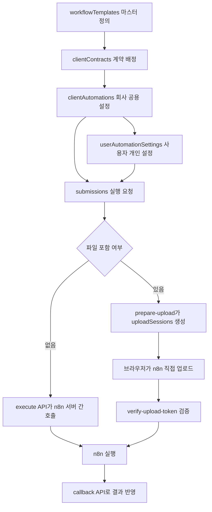

# N8Lient DB 연동 규약서

이 문서는 n8n 워크플로우를 엔팔라이언트(N8Lient) 데이터베이스 구조에 맞게 연동하거나 조회할 때 지켜야 할 Firestore DB 기준서이다.

> 업데이트 기준: n8n 직접 파일 업로드 + 1회성 uploadToken 검증 구조 반영

---

## 1. Firestore 컬렉션 구조 및 역할

N8Lient MVP의 핵심 데이터는 Firestore에 보관되며, 아래 10개 컬렉션을 중심으로 연동된다.

| 컬렉션명 | 설명 및 역할 | 문서 ID 규칙 |
| :--- | :--- | :--- |
| `clients` | 고객사 기본 정보 관리 | 임의 생성 ID 예: `client_rentaltoktok_001` |
| `users` | 사용자 프로필 및 권한 정보 | Firebase Auth `uid` |
| `companyCodeLookups` | 회사코드 입력 시 clientId 조회용 보안 룩업 | `trim().toUpperCase()` 기준 회사코드 |
| `companyJoinRequests` | 사용자 회사 가입 신청 이력 | `{uid}_{clientId}` |
| `workflowTemplates` | 운영자가 등록하는 N8N 워크플로우 마스터 명세 | `{workflowKey}` |
| `clientContracts` | 고객사별 N8N 워크플로우 사용권/계약 배정 | `{clientId}_{workflowKey}` |
| `clientAutomations` | 고객사가 등록한 회사 공용 기본 설정값 | 임의 생성 ID 예: `auto_expense_001` |
| `userAutomationSettings` | 사용자 개인 자동화 설정값 | `{uid}_{automationId}` |
| `submissions` | 사용자가 요청한 자동화 실행 요청서 및 이력 | `{submissionId}` |
| `uploadSessions` | 파일 직접 업로드용 1회성 검증 세션 | `{submissionId}` |

---

## 2. 컬렉션별 주요 필드 상세

### 2.1 clients

```json
{
  "clientId": "client_rentaltoktok_001",
  "companyName": "렌탈톡톡",
  "companyCode": "RTT2026",
  "status": "active",
  "ownerAdminUid": "firebase_uid_001",
  "defaultTimezone": "Asia/Seoul",
  "defaultReportEmail": "report@company.com",
  "defaultDriveRootFolderId": "company_google_drive_root_folder_id",
  "createdAt": "ISO_8601_Timestamp",
  "updatedAt": "ISO_8601_Timestamp"
}
```

### 2.2 users

```json
{
  "uid": "firebase_uid_001",
  "email": "user@gmail.com",
  "displayName": "김민수",
  "clientId": "client_rentaltoktok_001",
  "role": "user",
  "approvalStatus": "approved",
  "createdAt": "ISO_8601_Timestamp",
  "updatedAt": "ISO_8601_Timestamp"
}
```

### 2.3 workflowTemplates

운영자가 정의하는 N8N 워크플로우 마스터 명세다. Google OAuth 연결 ID나 API Key 자체를 입력받는 필드는 배제한다.

```json
{
  "workflowKey": "idea-catcher",
  "name": "아이디어 캐처",
  "shortName": "캐처",
  "status": "published",
  "webhookSecretId": "idea-catcher",
  "n8nServerKey": "main",
  "configSchemaVersion": 1,
  "inputSchema": {
    "acceptedInputTypes": ["text", "audio"],
    "allowedFileTypes": ["txt", "md", "webm", "mp3", "m4a", "wav"],
    "maxFileSizeMB": 10
  },
  "configSchema": [
    {
      "key": "mdFolderId",
      "label": "마크다운 저장 폴더 ID",
      "type": "text",
      "required": true
    },
    {
      "key": "originalFileFolderId",
      "label": "원본 파일 저장 폴더 ID",
      "type": "text",
      "required": true
    },
    {
      "key": "reportEmailTo",
      "label": "결과 보고 수신 이메일",
      "type": "email",
      "required": false
    }
  ]
}
```

`inputSchema.maxFileSizeMB`는 사용자 UI에서 허용할 파일 크기 기준이다. 파일 포함 실행은 기본적으로 n8n 직접 업로드 경로를 사용하므로, 서버리스 API 프록시 한도가 아니라 직접 업로드 검증 한도로 해석한다.

### 2.4 clientAutomations

회사 공용 기본 설정값이다. 사용자 개인 설정이 없거나 비어 있을 때 fallback으로 사용한다.

```json
{
  "automationId": "auto_idea_001",
  "clientId": "client_rentaltoktok_001",
  "workflowKey": "idea-catcher",
  "automationName": "아이디어 캐처",
  "enabled": true,
  "configStatus": "configured",
  "settings": {
    "mdFolderId": "company_default_md_folder_id",
    "originalFileFolderId": "company_default_original_folder_id",
    "reportEmailTo": "company-report@example.com"
  },
  "createdAt": "ISO_8601_Timestamp",
  "updatedAt": "ISO_8601_Timestamp"
}
```

### 2.5 userAutomationSettings

사용자 개인 설정값이다. 회사 공용 설정보다 우선 적용된다.

```json
{
  "settingId": "firebase_uid_001_auto_idea_001",
  "uid": "firebase_uid_001",
  "clientId": "client_rentaltoktok_001",
  "automationId": "auto_idea_001",
  "workflowKey": "idea-catcher",
  "settings": {
    "mdFolderId": "user_md_folder_id",
    "originalFileFolderId": "user_original_folder_id",
    "reportEmailTo": "user@example.com",
    "audioPrefix": "jangseunghee_audio",
    "mdPrefix": "jangseunghee_note"
  },
  "createdAt": "ISO_8601_Timestamp",
  "updatedAt": "ISO_8601_Timestamp"
}
```

빈 문자열, `null`, `undefined` 성격의 개인 설정값은 회사 공용 기본값을 덮어쓰지 않는다. `false`, `0`은 유효 값으로 취급할 수 있다.

### 2.6 submissions

자동화 실행 요청 및 결과 이력이다.

```json
{
  "submissionId": "sub_20260608_abcdef",
  "clientId": "client_rentaltoktok_001",
  "uid": "firebase_uid_001",
  "workflowKey": "idea-catcher",
  "automationId": "auto_idea_001",
  "status": "queued",
  "input": {
    "title": "오늘 떠오른 아이디어",
    "text": "아이디어 본문",
    "files": [
      {
        "fileName": "idea_audio.webm",
        "mimeType": "audio/webm",
        "sizeBytes": 8234412,
        "inputType": "audio"
      }
    ],
    "fileName": "idea_audio.webm",
    "mimeType": "audio/webm"
  },
  "settingsMergeSummary": {
    "hasUserSetting": true,
    "mergedKeys": ["mdFolderId", "originalFileFolderId"],
    "fallbackKeys": ["reportEmailTo"]
  },
  "result": {
    "resultUrl": null,
    "summary": null
  },
  "error": {
    "code": null,
    "message": null
  },
  "retryOf": null,
  "createdAt": "ISO_8601_Timestamp",
  "updatedAt": "ISO_8601_Timestamp",
  "completedAt": null
}
```

#### status 값

| status | 의미 |
| :--- | :--- |
| `queued` | 요청이 접수되었으나 아직 처리 시작 전 |
| `processing` | n8n이 처리 중 |
| `success` | 정상 완료 |
| `failed` | 실패 |
| `skipped` | 처리 제외 |
| `config_error` | 설정/권한 오류 |

#### 파일 업로드 관련 error.code 예시

| code | 의미 |
| :--- | :--- |
| `UPLOAD_FAILED` | 브라우저에서 n8n 직접 업로드가 실패함 |
| `UPLOAD_TIMEOUT_OR_FAILED` | uploadSession이 만료될 때까지 업로드가 완료되지 않음 |
| `UPLOAD_TOKEN_INVALID` | uploadToken 검증 실패 |
| `UPLOAD_TOKEN_EXPIRED` | uploadToken 만료 |
| `REQUIRED_SETTING_MISSING` | 필수 settings 누락 |
| `RESOURCE_PERMISSION_DENIED` | Google Drive/Sheet 권한 미공유 또는 접근 실패 |

### 2.7 uploadSessions

파일 포함 실행에서 브라우저가 n8n Webhook으로 직접 업로드할 수 있도록 발급하는 1회성 업로드 세션이다.

```json
{
  "submissionId": "sub_20260608_abcdef",
  "uid": "firebase_uid_001",
  "clientId": "client_rentaltoktok_001",
  "automationId": "auto_idea_001",
  "workflowKey": "idea-catcher",
  "tokenHash": "sha256_hash_of_upload_token",
  "expiresAt": "ISO_8601_Timestamp",
  "maxUploadBytes": 10485760,
  "status": "prepared",
  "n8nPayload": {
    "submissionId": "sub_20260608_abcdef",
    "clientId": "client_rentaltoktok_001",
    "uid": "firebase_uid_001",
    "workflowKey": "idea-catcher",
    "automationId": "auto_idea_001",
    "settings": {
      "mdFolderId": "user_or_company_md_folder_id",
      "originalFileFolderId": "user_or_company_original_folder_id"
    },
    "input": {
      "title": "오늘 떠오른 아이디어",
      "files": []
    },
    "requestedAt": "ISO_8601_Timestamp",
    "callbackUrl": "https://app.example.com/api/automation/callback"
  },
  "createdAt": "ISO_8601_Timestamp",
  "verifiedAt": null,
  "failedAt": null
}
```

#### uploadSessions.status 값

| status | 의미 |
| :--- | :--- |
| `prepared` | 토큰 발급 완료, 아직 n8n 검증 전 |
| `verified` | n8n이 verify-upload-token을 통해 검증 성공 |
| `failed` | 브라우저 직접 업로드 실패 |
| `expired` | 만료 시간 초과 후 정리 대상 |

`uploadToken` 원문은 Firestore에 저장하지 않는다. Firestore에는 `tokenHash`만 저장한다.

---

## 3. 데이터 라이프사이클 흐름



---

## 4. 설정 병합 및 우선순위 규칙

최종 실행 설정값(`finalSettings`)은 아래 순서로 병합한다.

```text
finalSettings = {
  ...clientAutomations.settings,
  ...userAutomationSettings.settings,
  ...input.overrideSettings
}
```

우선순위는 다음과 같다.

```text
input.overrideSettings > userAutomationSettings.settings > clientAutomations.settings
```

n8n은 이 병합을 직접 수행하지 않는다. 텍스트 전용 실행에서는 `execute API`가 병합한 settings를 사용하고, 파일 직접 업로드 실행에서는 `verify-upload-token API`가 반환한 canonical payload의 settings를 사용한다.

---

## 5. 아이디어 캐처(idea-catcher) 설정 매핑 예시

### 회사 공용 기본 설정

```json
{
  "mdFolderId": "company_default_md_folder_id",
  "originalFileFolderId": "company_default_original_file_folder_id",
  "reportEmailTo": "company-report@example.com"
}
```

### 사용자 개인 설정

```json
{
  "mdFolderId": "user_md_folder_id",
  "originalFileFolderId": "user_original_file_folder_id",
  "reportEmailTo": "user@example.com"
}
```

### 최종 settings

```json
{
  "mdFolderId": "user_md_folder_id",
  "originalFileFolderId": "user_original_file_folder_id",
  "reportEmailTo": "user@example.com"
}
```

---

## 6. 핵심 동치 규칙: configSchema.key ↔ settings

스키마 키 명칭이 서로 다르면 매핑 에러가 발생한다.

```text
workflowTemplates.configSchema[i].key
= clientAutomations.settings key
= userAutomationSettings.settings key
= 최종 payload.settings key
= n8n 내부 참조 key
```

예를 들어 n8n이 `settings.mdFolderId`를 사용한다면 configSchema key도 `mdFolderId`여야 한다.

---

## 7. n8n 워크플로우 개발 및 DB 조회 시 주의사항

1. **n8n의 설정값 획득 기본 원칙**
   * n8n은 Firestore를 직접 조회하지 않는다.
   * 서버 간 호출에서는 `payload.settings`를 사용한다.
   * 브라우저 직접 업로드에서는 `verify-upload-token`이 반환한 canonical payload의 `settings`를 사용한다.

2. **공용 Google 계정 Credential 고정**
   * Google Drive, Google Sheets, Gmail 노드는 공용 Google 계정 Credential을 고정 사용한다.
   * 대상 Drive/Sheet는 공용 Google 계정에 쓰기 권한으로 공유되어 있어야 한다.

3. **파일 원본 저장 금지**
   * Firestore에는 파일 원본, base64, Blob, binary를 저장하지 않는다.
   * Firebase Storage는 기본 저장소로 사용하지 않는다.
   * 파일 원본은 n8n이 Google Drive에 저장한다.

4. **submissions 직접 수정 금지**
   * n8n은 Firestore `submissions`를 직접 수정하지 않는다.
   * 결과 반영은 엔팔라이언트 callback API를 통해 수행한다.

5. **uploadSessions 접근 제한**
   * `uploadSessions`는 클라이언트가 직접 읽거나 쓰지 않는다.
   * prepare-upload, verify-upload-token, upload-failed API가 서버 권한으로만 다룬다.
