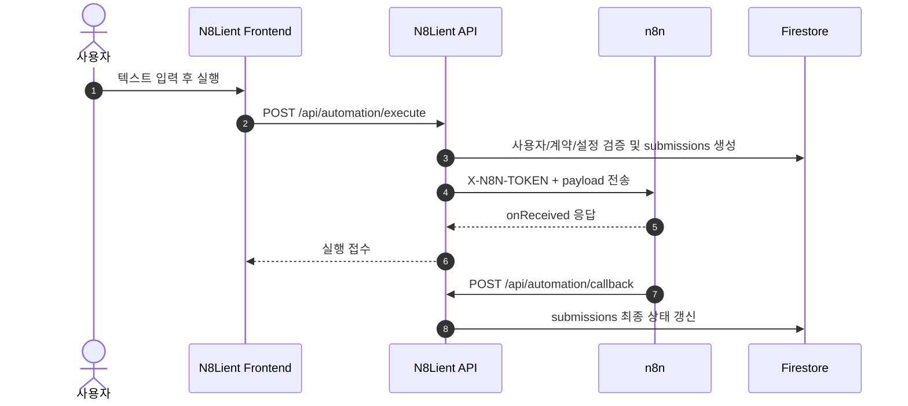
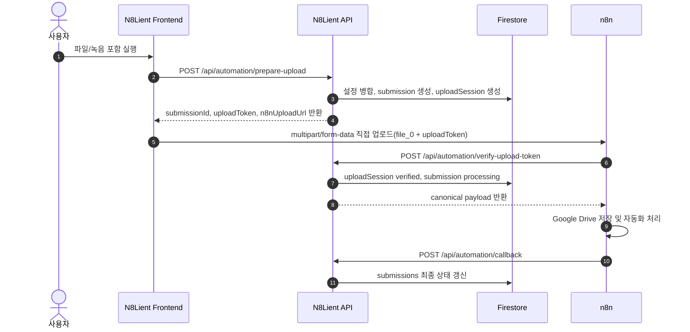

# N8Lient MVP 구조 개요서

이 문서는 n8n 워크플로우 개발자 및 협업 AI 에이전트가 엔팔라이언트(N8Lient)의 서비스 전체 아키텍처와 역할 분리 모델을 이해하기 위한 구조 개요서이다.

> 업데이트 기준: n8n 직접 파일 업로드 + 1회성 uploadToken 검증 구조 반영

---

## 1. N8Lient의 목적 및 철학

### 1.1 제품의 목적
엔팔라이언트(N8Lient)는 고객사(Client)가 n8n 기반의 자동화 워크플로우를 직접 제어(설정, 실행, 결과 확인)할 수 있도록 돕는 **웹 기반 자동화 클라이언트(자동화 리모컨)**이다. 기존 n8n의 복잡한 에디터 화면을 고객에게 노출하지 않고, 정돈된 B2B SaaS 형태의 컴팩트한 사용자 환경을 제공하는 것을 목적으로 한다.

### 1.2 개인화 업무 자동화 철학 (🚨 핵심 사상)
N8Lient는 단순한 회사 단위 공용 자동화 포털이 아니라, **회사가 지원하는 개인화 업무 자동화 포털**이다.

* **회사의 역할**: 자동화 사용권(계약)을 획득하고, 전체 사용자를 위해 초기 회사 공용 기본 설정값을 제공하고 지원한다.
* **사용자의 역할**: 자신의 구체적인 실무 환경에 맞춰 개인 업무 환경값(개인 이메일, 개인 Google Drive 폴더 ID 등)을 개인 설정값으로 직접 등록하고 관리한다.
* **우선순위 원칙**: 자동화 실행 시 사용자 개인 설정이 회사 공용 설정보다 항상 우선하여 적용된다. 회사 공용 설정은 개인 설정이 등록되어 있지 않은 경우에 한해 Fallback으로 동작한다.

---

## 2. N8Lient와 n8n의 역할 분리

엔팔라이언트와 n8n은 물리적 및 기능적으로 분리된다.

### 2.1 엔팔라이언트(Client WebApp & Gateway API)

* Google 로그인 및 사용자 승인 처리
* 회사 공용 설정값과 사용자 개인 설정값 관리
* 사용자 실행 입력값 수집(text/file/image/audio)
* 텍스트 전용 실행 게이트웨이(`/api/automation/execute`) 제공
* 파일 포함 실행 준비 API(`/api/automation/prepare-upload`) 제공
* n8n 직접 업로드 토큰 검증 API(`/api/automation/verify-upload-token`) 제공
* 직접 업로드 실패 처리 API(`/api/automation/upload-failed`) 제공
* n8n 완료 콜백 수신 API(`/api/automation/callback`) 제공
* 실행 이력(`submissions`) 상태 추적 및 노출

### 2.2 n8n(Automation Engine)

* 실제 비즈니스 로직 수행
* 서버 간 호출에서는 `execute API`가 전달한 병합 완료 `payload.settings`를 사용
* 브라우저 직접 파일 업로드 호출에서는 `verify-upload-token API`가 반환한 canonical `payload.settings`를 사용
* Google Drive/Gmail/Sheets 등 실제 외부 서비스 작업 수행
* 작업 완료 후 `callbackUrl`로 성공/실패 결과 보고

### 2.3 Firebase(Backend & Database)

* 회사 정보, 사용자 프로필, 계약 내역, 설정값, 실행 이력, 업로드 세션 보관
* 파일 원본, Blob, base64, binary는 Firestore에 저장하지 않는다.
* Firebase Storage는 기본 파일 저장소로 사용하지 않는다.

---

## 3. 사용자 역할(User Roles)

| 역할 | 설명 | 주요 담당 기능 |
| :--- | :--- | :--- |
| `user` | 고객사 소속 일반 사용자 | N8N 워크플로우 실행 요청, 실행 결과 확인, 개인 자동화 설정 관리 |
| `company_admin` | 고객사 관리자 | 회사 소속 사용자 승인/거절, 회사 공용 기본 설정 관리 |
| `operator` | 엔팔라이언트 운영자 | 고객사 등록, N8N 워크플로우 마스터 등록, 회사별 워크플로우 배정 |

---

## 4. 핵심 서비스 흐름(Core Flow)

1. 사용자는 Google Auth로 로그인한다.
2. 회사코드를 입력하고 가입 승인을 요청한다.
3. 회사 관리자가 사용자를 승인한다.
4. 운영자가 `workflowTemplates`에 N8N 워크플로우 마스터 명세를 등록한다.
5. 운영자가 `clientContracts`로 고객사와 워크플로우를 배정한다.
6. 회사 관리자가 `clientAutomations`에 회사 공용 기본 설정값을 등록한다.
7. 일반 사용자는 필요 시 `userAutomationSettings`에 개인 설정값을 등록한다.
8. 사용자가 워크플로우를 실행한다.

### 4.1 텍스트 전용 실행 흐름

### 4.2 파일 포함 실행 흐름

서버리스 업로드 제한을 피하기 위해 파일이 있는 실행은 브라우저가 n8n Webhook으로 직접 `multipart/form-data`를 전송한다. 단, 이 경로는 엔팔라이언트가 발급한 1회성 `uploadToken`이 있을 때만 허용한다.

---

## 5. 주요 화면과 라우트

* **일반 사용자 영역(`/user`)**
  * `/user`: 홈 화면
  * `/user/execute`: N8N 워크플로우 실행 요청, 개인 설정, text/file/image/audio 입력
  * `/user/results`: 실행 결과 목록 및 상세 보기
  * `/user/profile`: 내 정보 확인
* **회사 관리자 영역(`/company-admin`)**
  * `/company-admin/users`: 사용자 목록 및 가입 승인 관리
  * `/company-admin/automations`: 계약된 N8N 워크플로우의 회사 공용 설정 관리
  * `/company-admin/results`: 회사 소속 사용자의 실행 결과 모니터링
* **운영자 영역(`/operator`)**
  * `/operator/clients`: 고객사 마스터
  * `/operator/workflow-templates`: N8N 워크플로우 마스터
  * `/operator/contracts`: N8N 워크플로우 배정/매핑

---

## 6. MVP 범위 내 구현 현황

### 구현 완료 사항

* Google Auth 기반 로그인
* 회사코드 기반 가입 요청 및 회사 관리자 승인
* 운영자 콘솔의 고객사/N8N 워크플로우/매핑 관리
* 회사 관리자 콘솔의 회사 공용 설정 관리
* 사용자 개인 설정(`userAutomationSettings`) 관리
* `/api/automation/execute` 기반 텍스트 전용 실행
* `/api/automation/prepare-upload` 기반 파일 포함 실행 준비
* `/api/automation/verify-upload-token` 기반 n8n 직접 업로드 검증
* `/api/automation/upload-failed` 기반 클라이언트 업로드 실패 처리
* `/api/automation/callback` 기반 n8n 완료 결과 반영
* n8n 공용 Google 계정 Credential 정책
* Firestore 보안 규칙 기반 사용자/회사 범위 통제

### MVP 제외 사항(향후 확장 예정)

* 결제 및 과금 모듈
* 네이티브 앱 패키징 및 푸시 알림
* 대용량 업로드 재시도 큐
* 만료 uploadSessions 자동 정리 Cron
* Google Drive 결과물 전체 DB 마이그레이션 및 동기화 도구
* 부서/팀 단위 세분화 권한

---

## 7. n8n 워크플로우 수정 시 반드시 지켜야 할 원칙 (🚨 필수 준수)

1. **전체 구조 최소 변경**
   * 기존 n8n 워크플로우는 필요한 노드만 최소 수정한다.
   * 기존 정상 동작 중인 비즈니스 처리 노드는 함부로 갈아엎지 않는다.

2. **호출 경로 이원화 원칙**
   * 텍스트 전용 실행은 엔팔라이언트 `/api/automation/execute`가 n8n Webhook을 서버 간 호출한다.
   * 파일 포함 실행은 엔팔라이언트 `/api/automation/prepare-upload`가 발급한 1회성 `uploadToken`이 있는 경우에 한해 브라우저가 n8n Webhook으로 직접 `multipart/form-data`를 업로드할 수 있다.
   * 이 예외는 파일 용량 때문에 서버리스 게이트웨이를 우회하기 위한 제한적 경로다.

3. **브라우저 토큰 노출 금지**
   * 브라우저에는 `N8N_SERVER_MAIN_TOKEN`, `X-N8N-TOKEN`, n8n 공통 토큰, API Key를 절대 노출하지 않는다.
   * 브라우저 직접 업로드에는 `submissionId + uploadToken`만 사용한다.
   * `uploadToken`은 짧은 만료시간과 1회성 검증을 전제로 한다.

4. **settings 병합 책임 분리**
   * n8n은 Firestore를 직접 조회하거나 개인/회사 설정을 병합하지 않는다.
   * 서버 간 호출에서는 `execute API`가 전달한 `payload.settings`를 최종 실행 설정값으로 사용한다.
   * 브라우저 직접 업로드에서는 n8n이 `/api/automation/verify-upload-token`으로 검증한 뒤 반환받은 canonical `payload.settings`를 최종 실행 설정값으로 사용한다.

5. **Webhook URL/Secret 하드코딩 금지**
   * Webhook URL, Token, Secret, API Key는 노드 코드에 하드코딩하지 않는다.
   * 물리 URL과 토큰은 서버 환경변수 또는 N8Lient 서버가 반환한 값으로만 관리한다.

6. **공용 Google 계정 Credential 정책**
   * Google Drive, Google Sheets, Gmail 노드는 사용자별 Credential을 런타임에 동적으로 바꾸지 않는다.
   * n8n에는 공용 Google 계정 Credential을 고정 연결한다.
   * 개인/회사 Google Drive 폴더 또는 Sheet는 n8n 공용 Google 계정에 쓰기 권한으로 공유되어 있어야 한다.

7. **자격증명 전송 금지**
   * settings에는 폴더 ID, 시트 ID, 수신 이메일 등 대상 리소스 값만 넣는다.
   * Google Access Token, Refresh Token, n8n Credential ID, Gemini API Key는 settings에 넣지 않는다.

8. **파일 원본 저장소 원칙**
   * Firestore/Firebase Storage에 파일 원본, Blob, base64, binary를 저장하지 않는다.
   * 파일 원본은 n8n이 Google Drive에 저장한다.
   * Firestore에는 파일명, MIME, 크기, 상태, result URL 같은 메타데이터만 저장한다.

9. **Webhook binary 처리 원칙**
   * 파일 입력 워크플로우는 Webhook 노드가 `multipart/form-data`와 binary `file_0`를 받을 수 있게 구성한다.
   * 입력 정리 노드는 `file_0` 또는 워크플로우 내부 표준 binary 필드로 변환한다.

10. **CORS 설정 원칙**
    * 브라우저 직접 업로드를 지원하는 Webhook은 Allowed Origins(CORS)에 엔팔라이언트 운영 도메인과 로컬 테스트 도메인을 명시한다.
    * 운영 환경에서 `*` 허용은 금지한다.

11. **즉시 응답 의미 구분**
    * n8n Webhook의 즉시 응답(onReceived)은 처리 완료가 아니라 업로드/실행 접수 의미다.
    * 실제 완료 여부는 callback API로 갱신된 submissions 상태를 기준으로 판단한다.

12. **callback 원칙**
    * 작업 성공 시 `callbackUrl`로 success payload를 전송한다.
    * 작업 실패 시 failed 또는 config_error payload를 전송한다.
    * n8n이 Firestore `submissions`를 직접 수정하지 않고, 엔팔라이언트 callback API가 상태를 갱신한다.

13. **권한 누락 예외 처리**
    * Google Drive/Sheet 권한 미공유, 필수 settings 누락, 리소스 접근 실패는 무시하지 않는다.
    * callback failed 또는 config_error로 명확히 반환한다.

14. **Sticky Note 갱신**
    * n8n 워크플로우 내부 Sticky Note는 실제 입력 방식, settings, uploadToken, CORS, callback 구조와 일치해야 한다.
