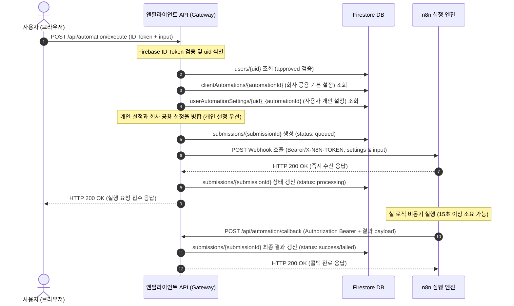

# N8Lient Webhook & Callback 연동 규약서

이 문서는 엔팔라이언트(N8Lient) 서버리스 API 게이트웨이와 외부 n8n Webhook 및 콜백 처리를 위한 상세 API 연동 규약서입니다.

---

## 1. API 역할 요약

엔팔라이언트의 자동화 실행 게이트웨이는 n8n의 실행 소요 시간이 길어져 발생하는 **HTTP Connection Timeout** 문제를 원천 차단하기 위해 **비동기 요청-콜백 구조**로 설계되었습니다.

*   **`POST /api/automation/execute`**
    *   **역할**: 클라이언트 전용 실행 요청 접수처. 사용자 인증 확인 및 권한 검증 후 n8n Webhook으로 비동기 실행을 의뢰합니다.
    *   **동작**: n8n 호출이 성공하면 즉시 브라우저에 `success: true`와 함께 `submissionId`를 응답하고 커넥션을 종료합니다. (상태: `processing`)
*   **`POST /api/automation/callback`**
    *   **역할**: n8n이 실행을 완료(성공 또는 실패)한 후, 최종 결과 데이터를 엔팔라이언트에 업데이트하는 외부 전용 엔드포인트입니다.
    *   **동작**: 전달받은 `submissionId`를 기반으로 Firestore 데이터를 안전하게 업데이트합니다. (상태: `success` 또는 `failed`)

---

## 2. 상세 실행 및 처리 흐름



---

## 3. API Payload 명세

### 3.1 [엔팔라이언트 → n8n] Webhook 실행 요청 Payload
`execute API`가 n8n Webhook 노드로 호출 시 전달하는 Payload 구조입니다. 

> [!NOTE]
> Payload 내의 `settings` 객체는 단순한 회사 공용 설정이 아닙니다. **사용자 개인 설정(`userAutomationSettings`)과 회사 공용 설정(`clientAutomations`)이 우선순위에 맞춰 병합 완료된 최종 실행 설정값**입니다.
> *   **병합 우선순위**: `사용자 개인 설정 > 회사 공용 설정 (Fallback)`
> *   **자격증명 전송 금지**: `settings`에는 오직 리소스의 식별 ID(예: `googleDriveFolderId`, `originalFileFolderId`, `googleSheetId`, `reportEmailTo`)만 전달하며, Google Access/Refresh Token, n8n Credential ID, Gemini API Key 등 자격증명 성격의 중요 값은 절대 포함시키지 않습니다.

#### 아이디어 캐처 (idea-catcher) Webhook Payload 예시:
```json
{
  "submissionId": "sub_20260608123456_abcdef",
  "clientId": "client_rentaltoktok_001",
  "uid": "firebase_uid_001",
  "workflowKey": "idea-catcher",
  "automationId": "auto_idea_001",
  "settings": {
    "mdFolderId": "user_or_company_md_folder_id",
    "originalFileFolderId": "user_or_company_original_file_folder_id",
    "reportEmailTo": "user_or_company_email@example.com",
    "geminiModel": "gemini-2.5-flash"
  },
  "input": {
    "title": "오늘 떠오른 아이디어",
    "text": "아이디어 본문",
    "fileUrl": null,
    "fileName": null,
    "mimeType": null
  },
  "requestedAt": "2026-06-08T12:25:56.000Z",
  "callbackUrl": "https://your-app-domain.example.com/api/automation/callback"
}
```

### 3.2 [n8n → 엔팔라이언트] Callback 성공 Payload
n8n이 작업을 정상 완료한 경우, `callbackUrl`로 보낼 POST Body 예시입니다.

```json
{
  "submissionId": "sub_20260608123456_abcdef",
  "status": "success",
  "result": {
    "summary": "총 3건의 영수증이 구글 시트에 정상 등록되었으며 회계 담당자 이메일로 전송되었습니다.",
    "resultUrl": "https://docs.google.com/spreadsheets/d/your_sheet_id"
  }
}
```

### 3.3 [n8n → 엔팔라이언트] Callback 실패 Payload
n8n 내부에서 예외나 에러가 발생한 경우, `callbackUrl`로 보낼 POST Body 예시입니다.

```json
{
  "submissionId": "sub_20260608123456_abcdef",
  "status": "failed",
  "error": {
    "code": "REQUIRED_SETTING_MISSING",
    "message": "구글 드라이브 폴더 ID(googleDriveFolderId) 설정 정보가 유효하지 않아 전송에 실패했습니다."
  }
}
```

---

## 4. 보안 및 인증 메커니즘

### 4.1 n8n Webhook 호출 인증 (엔팔라이언트 → n8n)
*   엔팔라이언트는 `workflowTemplates`에 정의된 `n8nServerKey`를 이용해 환경변수에서 인증 토큰을 로드합니다.
*   n8n Webhook 호출 시, 헤더에 **`X-N8N-TOKEN`** 값으로 서버 고유 토큰을 담아 보냅니다.
*   **주의**: 테스트 환경 등 토큰이 없는 경우는 헤더를 생략합니다.

### 4.2 Callback 호출 인증 (n8n → 엔팔라이언트)
*   n8n이 엔팔라이언트의 `/api/automation/callback`을 호출할 때는 반드시 **Bearer Secret** 헤더가 포함되어야 합니다.
*   인증 헤더:
    ```http
    Authorization: Bearer {N8N_CALLBACK_SECRET_VALUE}
    ```
*   해당 토큰 값이 엔팔라이언트 서버 내 `.env.local`의 `N8N_CALLBACK_SECRET`과 일치해야 처리됩니다. 불일치 시 `401 Unauthorized`를 응답합니다.

---

## 5. Webhook 경로 및 환경변수 매핑 규칙

엔팔라이언트 API 게이트웨이는 아래 규칙에 의거해 n8n Webhook의 실제 물리 주소와 토큰을 조합합니다.

### 5.1 n8n 서버 매핑 규칙 (Base URL & Token)
`workflowTemplates.n8nServerKey` 값을 대문자 및 언더스코어(`_`)로 치환하여 환경변수를 매핑합니다.
*   `n8nServerKey`가 `"main"` 인 경우:
    *   **Base URL**: `N8N_SERVER_MAIN_BASE_URL`
    *   **Token**: `N8N_SERVER_MAIN_TOKEN`

### 5.2 Webhook Path 매핑 규칙
`workflowTemplates.webhookSecretId` (또는 `workflowKey`) 값을 대문자 및 언더스코어(`_`)로 치환하여 Path 환경변수를 찾습니다.
*   `webhookSecretId`가 `"idea-catcher"` 인 경우:
    *   **Path 환경변수**: `N8N_WEBHOOK_PATH_IDEA_CATCHER`
*   `webhookSecretId`가 `"expense-report"` 인 경우:
    *   **Path 환경변수**: `N8N_WEBHOOK_PATH_EXPENSE_REPORT`

### 5.3 n8n 테스트 모드와 운영 모드 차이
n8n 워크플로우를 활성화하기 전, 디자인 환경에서 수동 테스트할 때와 실제 배포되어 상시 운영될 때의 Webhook Path가 다릅니다.
*   **테스트(개발용) URL**: `/webhook-test/...` 패턴 (n8n 에디터가 열려 있고 대기 중일 때만 동작함)
*   **운영(배포용) URL**: `/webhook/...` 패턴 (n8n 상에서 Active 상태인 워크플로우가 상시 수신함)

> [!IMPORTANT]
> 실 배포 시에는 `.env.local` 내의 `N8N_WEBHOOK_PATH_*` 값을 반드시 `/webhook/...` 로 지정해야 상시 자동화가 가동됩니다.

---

## 6. n8n 워크플로우 수정 시 체크리스트

n8n 워크플로우 개발자는 수정 시 다음 체크리스트를 준수하여 구현이 깨지지 않도록 해야 합니다.

*   [ ] **Webhook 노드 입력 속성**: JSON 형식을 허용하고, POST Method로 세팅되어 있는지 확인합니다.
*   [ ] **X-N8N-TOKEN 검증**: Webhook 노드의 Authentication 방식을 명시하거나, 들어오는 헤더의 `X-N8N-TOKEN`을 비교 검증하는 가드를 구성합니다.
*   [ ] **payload 추출**: 입력받은 데이터에서 `submissionId` 및 `callbackUrl` 속성을 유실하지 않도록 보존합니다.
*   [ ] **최종 settings 신뢰**: n8n 내부에서 회사 공용 설정과 개인 설정을 직접 병합하는 비즈니스 로직을 중복 구현하지 않고, 엔팔라이언트 `execute API`가 전달한 **`payload.settings`를 최종 실행 설정값으로 100% 신뢰**합니다.
*   [ ] **하드코딩 금지**: 이메일 수신자, Google Drive 폴더 ID 등은 워크플로우 노드 내에 하드코딩하지 않습니다.
*   [ ] **공용 Google 계정 Credential 가이드라인 준수**:
    *   Google Drive, Google Sheets, Gmail 관련 노드 수정 시 **Google Credential의 동적 매핑(교체)을 절대로 시도하지 마십시오.** n8n 내부에 등록해 둔 **공용 Google 계정 Credential**만 고정 연결합니다.
    *   사용자의 개인 폴더/시트를 사용하려면, 대상 Google Drive 리소스가 n8n 공용 Google 계정에 **쓰기(편집자) 권한으로 공유**되어 있어야 함을 체크합니다.
    *   `reportEmailTo`는 단순히 알림을 받을 수신자 이메일 주소이며, 실제 발신(보내는 사람)은 n8n 공용 Gmail 계정을 통해 처리됩니다.
    *   Gemini API Key는 `settings`로 받지 않고 n8n Credential 또는 서버 환경변수로 관리합니다.
*   [ ] **개인화 필드 매핑**: 개인 설정이 가미되는 자동화에서는 `settings.reportEmailTo`, `settings.mdFolderId`, `settings.originalFileFolderId` 등 병합된 속성 Key를 바인딩하여 업무 처리에 반영합니다.
*   [ ] **에러 콜백 처리**: 리소스 권한 누락으로 Google Drive 접근에 실패하거나, 설정된 최종값 필드가 유효하지 않으면 작업을 즉시 중단하고 `callback failed` 또는 `config_error` 상태를 담아 `callbackUrl`로 콜백을 반환합니다.
*   [ ] **비동기 타임아웃 우회**: HTTP Request에 동기 응답을 하는 대신, 즉시 200 OK를 리턴하도록 n8n Webhook 노드 설정을 해두고 백그라운드로 처리를 이어갑니다.
*   [ ] **완료 처리 콜백**: 자동화 처리가 정상 종료되면 `callbackUrl`로 **성공 payload**와 `Authorization: Bearer {N8N_CALLBACK_SECRET}` 헤더를 탑재해 전송합니다.
*   [ ] **실패 처리 콜백**: 오류 분기(Error Trigger 또는 If 노드 실패 분기)를 작성하여, 에러 발생 시 지정된 `error.code`와 메시지를 담아 **실패 payload**로 콜백을 호출합니다.
*   [ ] **로컬 개발 시의 callback 제한 사항**: n8n 실행 엔진이 외부 클라우드에 존재하는데 엔팔라이언트를 로컬(`localhost`)로 실행 중인 경우, 외부 n8n에서 `localhost/api/...` 콜백 주소로 접근할 수 없습니다. 이 경우 `ngrok` 등을 이용해 프록시 주소를 터널링한 후, `.env.local`의 `NEXT_PUBLIC_BASE_URL`에 프록시 도메인을 설정하여 통신해야 합니다.
