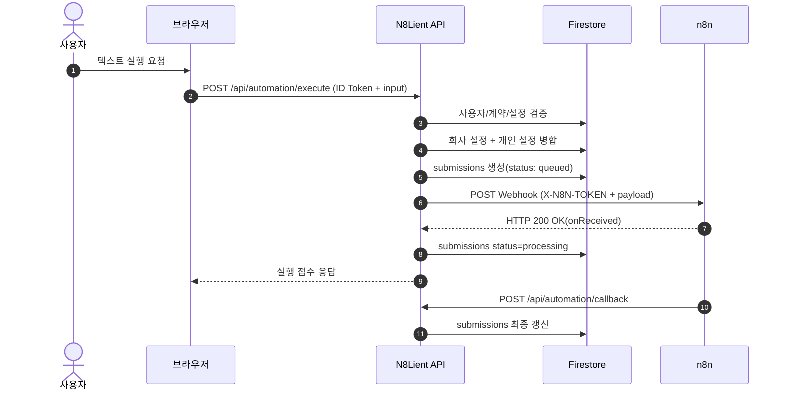
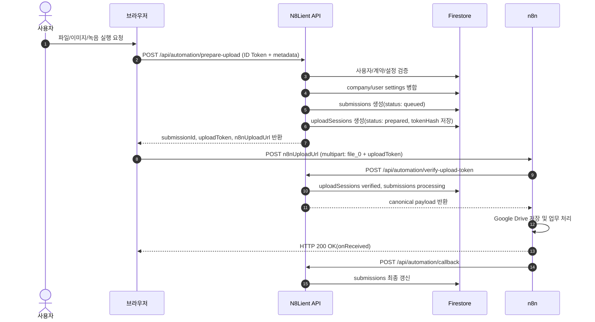
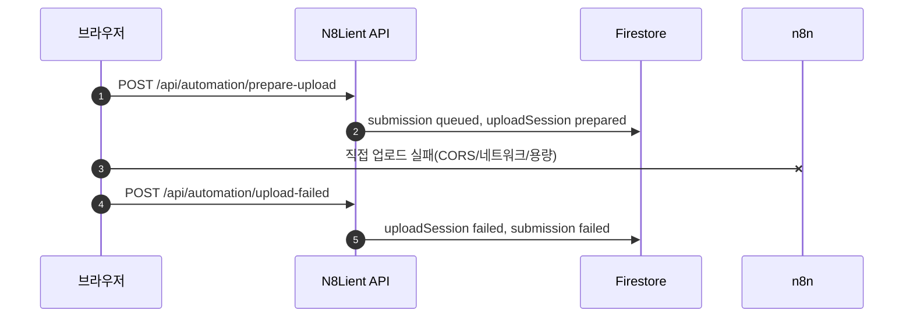

# N8Lient Webhook & Callback 연동 규약서

이 문서는 엔팔라이언트(N8Lient) 서버리스 API 게이트웨이와 외부 n8n Webhook 및 콜백 처리를 위한 상세 API 연동 규약서이다.

> 업데이트 기준: n8n 직접 파일 업로드 + 1회성 uploadToken 검증 구조 반영

---

## 1. API 역할 요약

엔팔라이언트의 자동화 실행 게이트웨이는 n8n 실행 시간이 길어져 발생하는 HTTP Connection Timeout 문제를 피하기 위해 비동기 요청-콜백 구조로 설계된다. 파일 포함 실행은 서버리스 업로드 용량 제한을 피하기 위해 n8n 직접 업로드 경로를 사용한다.

| API | 호출 주체 | 역할 |
| :--- | :--- | :--- |
| `POST /api/automation/execute` | 브라우저 | 텍스트 전용 실행 요청 접수. 권한 검증 후 n8n을 서버 간 호출한다. |
| `POST /api/automation/prepare-upload` | 브라우저 | 파일 포함 실행 준비. 설정 병합, submission 생성, uploadToken 발급, n8nUploadUrl 반환. |
| `POST /api/automation/verify-upload-token` | n8n | 브라우저 직접 업로드 요청의 uploadToken 검증. canonical payload 반환. |
| `POST /api/automation/upload-failed` | 브라우저 | n8n 직접 업로드 실패 시 queued/prepared 고착 방지를 위해 실패 상태로 갱신. |
| `POST /api/automation/callback` | n8n | n8n 실행 완료 후 success/failed 결과 반영. |

---

## 2. 상세 실행 및 처리 흐름

### 2.1 텍스트 전용 실행 흐름



### 2.2 파일 포함 실행 흐름



### 2.3 파일 업로드 실패 흐름



브라우저 탭 강제 종료나 디바이스 전원 종료처럼 `upload-failed` 호출 자체가 불가능한 경우는 차후 Cron/배치가 만료된 `uploadSessions`를 정리해야 한다.

---

## 3. API Payload 명세

### 3.1 execute API 요청(text-only)

```json
{
  "automationId": "auto_idea_001",
  "input": {
    "title": "오늘 떠오른 아이디어",
    "text": "아이디어 본문"
  }
}
```

### 3.2 prepare-upload 요청(file 포함)

```json
{
  "automationId": "auto_idea_001",
  "input": {
    "title": "오늘 떠오른 아이디어",
    "text": "선택 입력 메모",
    "files": [
      {
        "fileName": "idea_audio.webm",
        "mimeType": "audio/webm",
        "sizeBytes": 8234412,
        "inputType": "audio"
      }
    ]
  }
}
```

### 3.3 prepare-upload 응답

```json
{
  "submissionId": "sub_20260608_abcdef",
  "uploadToken": "one_time_random_token",
  "n8nUploadUrl": "https://n8n.example.com/webhook/n8lient-idea-catcher",
  "expiresAt": "2026-06-08T12:30:00.000Z",
  "maxUploadBytes": 10485760
}
```

브라우저에는 공통 `X-N8N-TOKEN`을 절대 반환하지 않는다.

### 3.4 브라우저 → n8n 직접 업로드 multipart 구조

```text
FormData
- submissionId: sub_20260608_abcdef
- uploadToken: one_time_random_token
- payload: JSON.stringify({ submissionId, uploadToken, input })
- file_0: File 또는 Blob
```

n8n Webhook은 `file_0` binary를 수신할 수 있어야 한다.

### 3.5 verify-upload-token 요청(n8n → N8Lient)

```json
{
  "submissionId": "sub_20260608_abcdef",
  "uploadToken": "one_time_random_token"
}
```

### 3.6 verify-upload-token 성공 응답

```json
{
  "valid": true,
  "payload": {
    "submissionId": "sub_20260608_abcdef",
    "clientId": "client_rentaltoktok_001",
    "uid": "firebase_uid_001",
    "workflowKey": "idea-catcher",
    "automationId": "auto_idea_001",
    "settings": {
      "mdFolderId": "user_or_company_md_folder_id",
      "originalFileFolderId": "user_or_company_original_folder_id",
      "reportEmailTo": "user@example.com",
      "geminiModel": "gemini-2.5-flash"
    },
    "input": {
      "title": "오늘 떠오른 아이디어",
      "text": "선택 입력 메모",
      "files": [
        {
          "fileName": "idea_audio.webm",
          "mimeType": "audio/webm",
          "sizeBytes": 8234412,
          "inputType": "audio"
        }
      ]
    },
    "requestedAt": "2026-06-08T12:25:56.000Z",
    "callbackUrl": "https://app.example.com/api/automation/callback"
  }
}
```

### 3.7 verify-upload-token 실패 응답

```json
{
  "valid": false,
  "error": "UPLOAD_TOKEN_EXPIRED"
}
```

### 3.8 callback 성공 Payload

```json
{
  "submissionId": "sub_20260608_abcdef",
  "status": "success",
  "result": {
    "summary": "아이디어 카드노트가 생성되었습니다.",
    "resultUrl": "https://drive.google.com/file/d/result_file_id/view"
  }
}
```

### 3.9 callback 실패 Payload

```json
{
  "submissionId": "sub_20260608_abcdef",
  "status": "failed",
  "error": {
    "code": "RESOURCE_PERMISSION_DENIED",
    "message": "Google Drive 폴더에 공용 계정 쓰기 권한이 없습니다."
  }
}
```

---

## 4. 보안 및 인증 메커니즘

### 4.1 서버 간 n8n Webhook 호출 인증

* `execute API`가 n8n Webhook을 호출할 때는 `X-N8N-TOKEN` 헤더를 사용한다.
* 토큰 값은 엔팔라이언트 서버 환경변수에서만 읽는다.
* 브라우저와 Firestore에는 저장하지 않는다.

### 4.2 브라우저 직접 업로드 인증

* 브라우저는 공통 `X-N8N-TOKEN`을 사용하지 않는다.
* `prepare-upload`가 발급한 `submissionId + uploadToken`만 n8n에 보낸다.
* n8n은 `/api/automation/verify-upload-token`으로 tokenHash, 만료, 1회 사용 여부를 검증한다.
* 검증 성공 시에만 canonical payload를 사용해 후속 처리를 진행한다.

### 4.3 callback 인증

n8n이 `/api/automation/callback`을 호출할 때는 Bearer Secret을 사용한다.

```http
Authorization: Bearer {N8N_CALLBACK_SECRET_VALUE}
```

해당 값은 엔팔라이언트 서버 환경변수 `N8N_CALLBACK_SECRET`과 일치해야 한다.

### 4.4 upload-failed 인증

`upload-failed` API는 브라우저가 호출하므로 Firebase ID Token을 검증한다. 해당 submission/uploadSession의 `uid`가 현재 사용자와 일치해야 실패 처리할 수 있다.

---

## 5. Webhook 경로 및 환경변수 매핑 규칙

### 5.1 n8n 서버 매핑

`workflowTemplates.n8nServerKey` 값을 기준으로 서버 환경변수를 찾는다.

* `main` → `N8N_SERVER_MAIN_BASE_URL`
* `main` → `N8N_SERVER_MAIN_TOKEN`

### 5.2 Webhook Path 매핑

`workflowTemplates.webhookSecretId` 또는 `workflowKey`를 기준으로 path 환경변수를 찾는다.

* `idea-catcher` → `N8N_WEBHOOK_PATH_IDEA_CATCHER`
* `expense-report` → `N8N_WEBHOOK_PATH_EXPENSE_REPORT`

### 5.3 테스트/운영 Webhook 차이

* 테스트: `/webhook-test/...`
* 운영: `/webhook/...`

운영 배포 시에는 `N8N_WEBHOOK_PATH_*`를 반드시 `/webhook/...` 값으로 설정한다.

### 5.4 n8n 직접 업로드 URL

파일 포함 실행의 `n8nUploadUrl`은 `prepare-upload` API가 반환한다. 브라우저는 이 URL에 직접 multipart 요청을 보낼 수 있지만, 공통 토큰은 받지 않는다.

---

## 6. CORS 및 Webhook 설정

브라우저가 n8n Webhook으로 직접 업로드하려면 n8n Webhook의 Allowed Origins(CORS)에 엔팔라이언트 프론트 도메인을 허용해야 한다.

권장값 예시:

```text
https://n8lient.netlify.app,http://localhost:3000
```

운영에서는 `*` 허용을 금지한다.

Webhook 노드는 아래 조건을 만족해야 한다.

* HTTP Method: `POST`
* Respond: `Immediately` 또는 onReceived 성격의 즉시 응답
* multipart/form-data 수신 가능
* binary `file_0` 수신 가능
* Response Data는 처리 완료 결과가 아니라 접수 응답임을 전제로 한다.

---

## 7. n8n 워크플로우 수정 시 체크리스트

* [ ] Webhook 노드가 POST로 설정되어 있는가.
* [ ] Webhook 노드가 multipart/form-data와 binary `file_0`를 받을 수 있는가.
* [ ] Webhook Allowed Origins(CORS)에 운영 도메인과 로컬 테스트 도메인이 설정되어 있는가.
* [ ] 운영에서 CORS `*` 허용을 피했는가.
* [ ] `00 환경설정` 노드가 서버 간 호출의 `X-N8N-TOKEN` 검증을 유지하는가.
* [ ] `00 환경설정` 노드가 브라우저 직접 업로드의 `submissionId + uploadToken`을 추출하는가.
* [ ] `00 환경설정` 노드가 `/api/automation/verify-upload-token`을 호출하고 valid true일 때 canonical payload를 사용하는가.
* [ ] n8n이 Firestore를 직접 조회하거나 개인/회사 설정을 직접 병합하지 않는가.
* [ ] settings는 엔팔라이언트가 병합한 최종 값만 사용하는가.
* [ ] Google Drive/Gmail/Sheets는 공용 Google 계정 Credential을 고정 사용하는가.
* [ ] Google Access Token, Refresh Token, n8n Credential ID, Gemini API Key를 settings로 받지 않는가.
* [ ] 파일 원본/base64/Blob을 Firestore/Firebase Storage에 저장하지 않는가.
* [ ] 원본 파일은 n8n이 Google Drive에 저장하는가.
* [ ] Google Drive 권한 누락 시 failed 또는 config_error callback을 반환하는가.
* [ ] 정상 완료 시 callbackUrl로 success payload를 전송하는가.
* [ ] 실패 시 callbackUrl로 failed payload를 전송하거나 공통 오류 리포터가 실패 callback을 보장하는가.
* [ ] Webhook 즉시 응답을 처리 완료로 오해하지 않도록 Sticky Note에 명시했는가.
* [ ] 로컬 개발에서 외부 n8n이 callbackUrl에 접근할 수 있도록 `NEXT_PUBLIC_BASE_URL` 또는 터널링 주소를 설정했는가.
