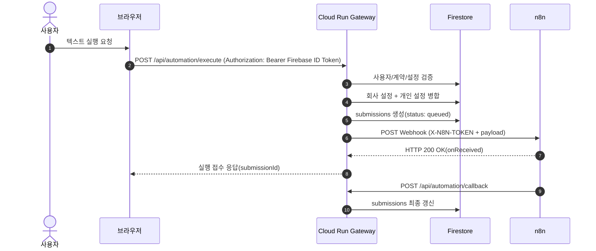
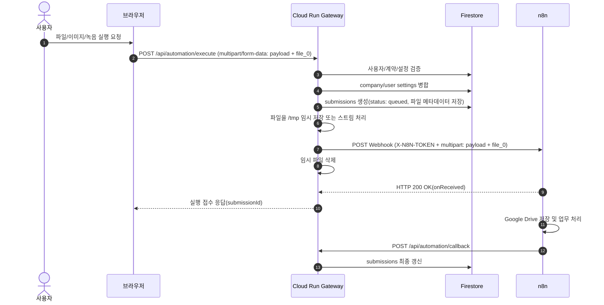
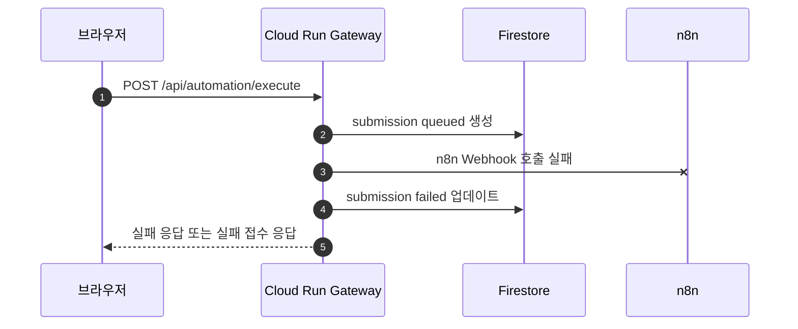

# N8Lient Webhook & Callback 연동 규약서 v1.3

이 문서는 엔팔라이언트(N8Lient) Cloud Run Gateway와 외부 n8n Webhook 및 콜백 처리를 위한 상세 API 연동 규약서이다.

> 업데이트 기준: **Cloud Run Gateway API 경유 구조 및 Drive/Service Account 호환 정책 반영**  
> 이전의 `브라우저 → n8n 직접 업로드`, `uploadToken`, `verify-upload-token`, `upload-failed`, `uploadSessions` 구조는 표준 구조에서 제외한다.

---

## 1. API 역할 요약

엔팔라이언트의 자동화 실행 게이트웨이는 n8n 실행 시간이 길어져 발생하는 HTTP Connection Timeout 문제를 피하기 위해 비동기 요청-콜백 구조로 설계된다. 파일 포함 실행도 브라우저가 n8n으로 직접 전송하지 않고 Cloud Run Gateway가 수신한 뒤 n8n에 서버 간 전송한다.

| API | 위치 | 호출 주체 | 역할 |
| :--- | :--- | :--- | :--- |
| `GET /health` | Cloud Run Gateway | 브라우저/운영자/헬스체크 | Gateway 서버 기동 상태 확인 |
| `POST /api/automation/execute` | Cloud Run Gateway | 브라우저 | 텍스트/파일 실행 요청 통합 접수. 권한 검증, 설정 병합, submissions 생성, n8n 서버 간 호출 수행 |
| `POST /api/automation/callback` | Cloud Run Gateway | n8n | n8n 실행 완료 후 success/failed/config_error 결과 반영 |

### 표준 구조에서 제외된 API

| API | 처리 방침 |
| :--- | :--- |
| `POST /api/automation/prepare-upload` | 사용하지 않는다. |
| `POST /api/automation/verify-upload-token` | 사용하지 않는다. |
| `POST /api/automation/upload-failed` | 사용하지 않는다. |

---

## 2. 상세 실행 및 처리 흐름

### 2.1 텍스트 전용 실행 흐름



### 2.2 파일 포함 실행 흐름



### 2.3 n8n 호출 실패 흐름



---

## 3. API Payload 명세

### 3.1 execute API 요청(text-only, JSON)

```http
POST /api/automation/execute
Authorization: Bearer {FIREBASE_ID_TOKEN}
Content-Type: application/json
```

```json
{
  "automationId": "auto_idea_001",
  "input": {
    "title": "오늘 떠오른 아이디어",
    "text": "아이디어 본문"
  }
}
```

### 3.2 execute API 요청(file 포함, multipart/form-data)

```http
POST /api/automation/execute
Authorization: Bearer {FIREBASE_ID_TOKEN}
Content-Type: multipart/form-data
```

```text
FormData
- payload: JSON.stringify({ automationId, input })
- file_0: File 또는 Blob
```

`payload` 예시:

```json
{
  "automationId": "auto_idea_001",
  "input": {
    "title": "오늘 떠오른 아이디어",
    "text": "선택 입력 메모",
    "files": [
      {
        "fileName": "idea_audio.webm",
        "mimeType": "audio/webm",
        "sizeBytes": 8234412,
        "inputType": "audio"
      }
    ]
  }
}
```

### 3.3 execute API 성공 응답

```json
{
  "ok": true,
  "submissionId": "sub_20260608_abcdef",
  "status": "queued"
}
```

Gateway는 n8n Webhook이 HTTP 200을 반환하면 사용자에게 실행 접수 성공을 응답한다. 이 응답은 업무 처리 완료가 아니다.

### 3.4 Gateway → n8n 서버 간 JSON 호출

```http
POST https://n8n.example.com/webhook/n8lient-idea-catcher
X-N8N-TOKEN: {N8N_SERVER_MAIN_TOKEN}
Content-Type: application/json
```

```json
{
  "submissionId": "sub_20260608_abcdef",
  "clientId": "client_rentaltoktok_001",
  "uid": "firebase_uid_001",
  "workflowKey": "idea-catcher",
  "automationId": "auto_idea_001",
  "settings": {
    "driveId": "shared_drive_id_or_empty_for_my_drive",
    "mdFolderId": "user_or_company_md_folder_id",
    "originalFileFolderId": "user_or_company_original_file_folder_id",
    "reportEmailTo": "user@example.com"
  },
  "input": {
    "title": "오늘 떠오른 아이디어",
    "text": "아이디어 본문"
  },
  "requestedAt": "2026-06-08T12:25:56.000Z",
  "callbackUrl": "https://n8lient-gateway-xxxx.run.app/api/automation/callback"
}
```

### 3.5 Gateway → n8n 서버 간 multipart 호출

```text
FormData
- payload: JSON.stringify(canonicalPayload)
- file_0: Gateway가 수신한 원본 파일 스트림
```

n8n Webhook은 `file_0` binary를 수신할 수 있어야 한다.

### 3.6 callback 성공 Payload

```http
POST /api/automation/callback
Authorization: Bearer {N8N_CALLBACK_SECRET_VALUE}
Content-Type: application/json
```

```json
{
  "submissionId": "sub_20260608_abcdef",
  "status": "success",
  "result": {
    "summary": "아이디어 카드노트가 생성되었습니다.",
    "resultUrl": "https://drive.google.com/file/d/result_file_id/view"
  }
}
```

### 3.7 callback 실패 Payload

```json
{
  "submissionId": "sub_20260608_abcdef",
  "status": "failed",
  "error": {
    "code": "RESOURCE_PERMISSION_DENIED",
    "message": "Google Drive 폴더에 공용 계정 쓰기 권한이 없습니다."
  }
}
```

### 3.8 callback 설정 오류 Payload

```json
{
  "submissionId": "sub_20260608_abcdef",
  "status": "config_error",
  "error": {
    "code": "REQUIRED_SETTING_MISSING",
    "message": "필수 설정값 originalFileFolderId가 없습니다."
  }
}
```

### 3.9 Drive settings 의미

`settings.driveId`는 선택값이다.

| 저장소 | `driveId` | `mdFolderId` / `originalFileFolderId` |
| :--- | :--- | :--- |
| My Drive | 생략 또는 빈 문자열 | My Drive 내부 폴더 ID |
| Shared Drive | Shared Drive ID | Shared Drive 내부 폴더 ID |

Gateway는 회사 설정과 개인 설정을 병합할 때 `driveId`도 일반 settings 값처럼 병합한다. n8n은 병합을 직접 수행하지 않고 최종 `payload.settings.driveId`를 사용한다.

`driveId`는 Credential이나 Secret이 아니다. 브라우저에 Secret으로 취급해 숨길 값은 아니지만, 사용자가 임의로 잘못 입력하면 Drive 접근 실패가 발생할 수 있으므로 설정 검증 대상이다.

---

## 4. 보안 및 인증 메커니즘

### 4.1 브라우저 → Gateway 인증

* 브라우저는 `Authorization: Bearer {Firebase ID Token}`으로 Gateway를 호출한다.
* Gateway는 Firebase Admin SDK로 ID Token을 검증한다.
* Gateway는 `users/{uid}`를 조회해 `approvalStatus === 'approved'`인지 확인한다.
* Gateway는 사용자의 `clientId`와 실행 대상 `clientAutomations.clientId`가 일치하는지 검증한다.

### 4.2 Gateway → n8n Webhook 인증

* Gateway가 n8n Webhook을 호출할 때는 `X-N8N-TOKEN` 헤더를 사용한다.
* 토큰 값은 Gateway 환경변수 `N8N_SERVER_MAIN_TOKEN`에서만 읽는다.
* 브라우저와 Firestore에는 저장하지 않는다.

### 4.3 callback 인증

n8n이 `/api/automation/callback`을 호출할 때는 Bearer Secret을 사용한다.

```http
Authorization: Bearer {N8N_CALLBACK_SECRET_VALUE}
```

해당 값은 Gateway 환경변수 `N8N_CALLBACK_SECRET`과 일치해야 한다.


### 4.4 Google Drive Credential 및 Service Account 정책

Google Drive/Sheets 저장용 Credential은 운영용 OAuth 계정 Credential 또는 Google Service Account Credential을 사용할 수 있다.

* OAuth 계정 Credential은 해당 계정에 공유된 My Drive/Shared Drive 리소스에 접근할 수 있다.
* Service Account Credential은 Shared Drive 기반 운영을 기본 권장한다.
* Service Account가 파일을 저장하려면 해당 Shared Drive 또는 대상 폴더에 서비스 계정 이메일이 편집 권한을 가져야 한다.
* Gmail 발송은 Drive 저장 Credential과 분리하여 공용 Gmail OAuth Credential을 사용할 수 있다.
* Google Access Token, Refresh Token, Service Account private key, n8n Credential ID는 payload/settings에 포함하지 않는다.

### 4.5 Secret 보관 원칙

MVP 테스트 단계에서는 Cloud Run 환경변수로 운영할 수 있다. 운영 고도화 단계에서는 아래 값은 Google Secret Manager로 이전한다.

* `FIREBASE_ADMIN_PRIVATE_KEY`
* `N8N_SERVER_MAIN_TOKEN`
* `N8N_CALLBACK_SECRET`

---

## 5. Webhook 경로 및 환경변수 매핑 규칙

### 5.1 n8n 서버 매핑

`workflowTemplates.n8nServerKey` 값을 기준으로 Gateway 환경변수를 찾는다.

* `main` → `N8N_SERVER_MAIN_BASE_URL`
* `main` → `N8N_SERVER_MAIN_TOKEN`

### 5.2 Webhook Path 매핑

`workflowTemplates.webhookSecretId` 또는 `workflowKey`를 기준으로 path 환경변수를 찾는다.

| 값 | 권장 환경변수 |
| :--- | :--- |
| `n8lient-idea-catcher` | `N8N_WEBHOOK_PATH_N8LIENT_IDEA_CATCHER` |
| `idea-catcher` | `N8N_WEBHOOK_PATH_IDEA_CATCHER` |

운영 환경에서는 다음처럼 운영 Webhook을 사용한다.

```env
N8N_WEBHOOK_PATH_N8LIENT_IDEA_CATCHER=/webhook/n8lient-idea-catcher
```

테스트 환경에서는 필요 시 아래처럼 변경한다.

```env
N8N_WEBHOOK_PATH_N8LIENT_IDEA_CATCHER=/webhook-test/n8lient-idea-catcher
```

---

## 6. CORS 및 Webhook 설정

### 6.1 Frontend → Gateway CORS

브라우저는 Gateway만 호출한다. 따라서 CORS 허용은 Cloud Run Gateway에서 관리한다.

권장 `ALLOWED_ORIGINS` 예시:

```text
https://n8lient.netlify.app,http://localhost:3000
```

운영 환경에서 `*` 허용은 피한다.

### 6.2 Frontend → n8n 직접 CORS 제외

표준 구조에서는 브라우저가 n8n Webhook을 직접 호출하지 않는다. 따라서 n8n Webhook의 CORS Allowed Origins 설정은 표준 실행 구조의 필수 항목이 아니다.

### 6.3 n8n Webhook 기본 조건

Webhook 노드는 아래 조건을 만족해야 한다.

* HTTP Method: `POST`
* Respond: `Immediately` 또는 onReceived 성격의 즉시 응답
* JSON payload 수신 가능
* multipart/form-data 수신 가능
* binary `file_0` 수신 가능
* `X-N8N-TOKEN` 검증 실패 시 후속 노드 실행 차단
* Response Data는 처리 완료 결과가 아니라 접수 응답임을 전제로 한다.

---

## 7. n8n 워크플로우 수정 시 체크리스트

* [ ] Webhook 노드가 POST로 설정되어 있는가.
* [ ] Webhook 노드가 JSON과 multipart/form-data를 모두 받을 수 있는가.
* [ ] Webhook 노드가 binary `file_0`를 받을 수 있는가.
* [ ] `00 환경설정` 노드가 `X-N8N-TOKEN`을 검증하는가.
* [ ] `00 환경설정` 노드에서 `uploadToken`, `verify-upload-token`, `N8LIENT_BASE_URL` 분기가 제거되어 있는가.
* [ ] n8n이 Firestore를 직접 조회하거나 개인/회사 설정을 직접 병합하지 않는가.
* [ ] settings는 Gateway가 병합한 `payload.settings`만 사용하는가.
* [ ] Google Drive/Gmail/Sheets는 공용 Credential을 고정 사용하는가.
* [ ] Google Drive/Sheets Credential이 OAuth 계정인지 Service Account인지 확인했는가.
* [ ] Google Drive 노드의 `driveId`가 My Drive 고정인지, `settings.driveId` 기반 Shared Drive 호환인지 확인했는가.
* [ ] Shared Drive 사용 시 `settings.driveId`와 폴더 ID가 분리되어 있는가.
* [ ] Service Account 사용 시 해당 Shared Drive 또는 대상 폴더에 서비스 계정 이메일 편집 권한이 있는가.
* [ ] Google Access Token, Refresh Token, Service Account private key, n8n Credential ID, Gemini API Key를 settings로 받지 않는가.
* [ ] 파일 원본/base64/Blob을 Firestore/Firebase Storage에 저장하지 않는가.
* [ ] 원본 파일은 n8n이 Google Drive에 저장하는가.
* [ ] Google Drive 권한 누락, 잘못된 `driveId`, 잘못된 `folderId` 발생 시 failed 또는 config_error callback을 반환하는가.
* [ ] 정상 완료 시 `callbackUrl`로 success payload를 전송하는가.
* [ ] 실패 시 `callbackUrl`로 failed 또는 config_error payload를 전송하거나 공통 오류 리포터가 실패 callback을 보장하는가.
* [ ] Webhook 즉시 응답을 처리 완료로 오해하지 않도록 Sticky Note에 명시했는가.
* [ ] callbackUrl은 Cloud Run Gateway의 `/api/automation/callback` 주소인가.
